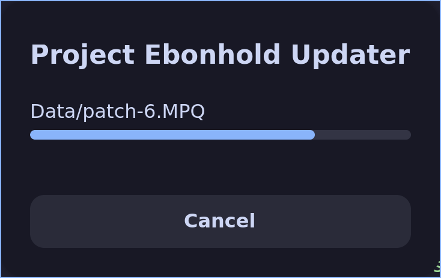

# Ebonhold Updater

A bash-based updater script for Project Ebonhold, a World of Warcraft custom server. The updater downloads and verifies game files by comparing MD5 hashes against a remote manifest.

As of January 24 2026, checking for updates and downloading updates requires you to be logged using your Project Ebonhold user account. Project Ebonhold's team has said that this is a precausionary measure to avoid issues related to resource management. This script will prompt you for username and password, and will request an authToken from Project Ebonhold's API. It will then store the token in a file called .updaterToken for further use. There is no obfuscation in this script and you can see that the script only connects to Project Ebonhold's API. The token is stored in plain text, but this is the same as the official launcher or your webbrowser does when you are logged into a website like Project Ebonhold. However a webbrowser does obfuscate where it stores the token. 



## Features

- **Automated File Verification**: Compares local file MD5 hashes against remote manifest
- **GUI Progress Tracking**: User-friendly progress dialogs using zenity
- **Steam Integration**: Seamlessly handles Steam launch arguments
- **Game Mods:** using `--mods=hd_patch` you can enable downloading/updating/verifying the hd_patch
- **Game Modes:** using `--game=roguelike` for the PTR server, currently it defaults to `--game=roguelike-prod`

## Prerequisites

The following system packages are required:
- `curl`
- `jq`
- `zenity`

*Note: `md5sum` and `stat` are also required but are usually pre-installed.*

## Installation

1. Place `ebonhold-updater.sh` in your World of Warcraft Wrath of the Litchking directory or the directory where you want to download World of Warcraft
2. Make the script executable:
   ```bash
   chmod +x ebonhold-updater.sh
   ```

## Usage

### Basic Usage

This will either update your local installation or ask you if you want to download the full game if it doesn't find Wow.exe

```bash
./ebonhold-updater.sh
```

### Install/update HD client mod

```bash
./ebonhold-updater.sh --mods=hd_patch
```

### Debug output

Script will output information to the terminal if you run it with the debug flag

```bash
./ebonhold-updater --debug
# or
debug=true ./ebonhold-updater.sh
```

### Verify game files

Verifying game files will check all game files, and download, missing, outdated or files that doesn't match.

```bash
./ebonhold-updater.sh --verify
```
### Switching to Public Test Realm

```bash
./ebonhold-updater.sh --game=roguelike
```

note not having `--game=roguelike` is the same as `--game=roguelike-prod` and will download the main game. If you want to stay in PTR permanently make a shortcut including `--game=roguelike`

if in the future the API changes such that the main game is called roguelike and the ptr is called roguelkike-ptr instead, Ill update the default game, and the readme.

### Steam Integration (Optional)

1. If you don't already have World of Warcraft Wrath of the Litchking installed, please run the ebonhold-updater.sh script one time first.
2. Add `Wow.exe` as a Non-Steam Game
3. Make sure "Start In" target in Steam is the folder that has `Wow.exe`, it should already be the correct value.
4. Set Force the Use of a Specific Steam Play Compatibility tool by: right clicking the game, Properties, Compatibility.
5. Add the following as a launch option

```
./ebonhold-updater.sh %command%
```

Technically, the script will detect it is running in Steam, and rewrite Steam's launch command so that the script is running inside the Steam Runtime, and inside gamescope (if in use). We need to do this so we are able to display the window with the progress bar on systems that use gamescope

## TODO

* Improve handling of --mods, currently it does not handle if you give it a name of a mod not available in the API. (currently only mod is "hd_patch", so use --mods=hd_patch )
* Improve handling og --game= currently it works fine, but when Project Ebonhold add more game modes we might have to handle deleting files when switching game mode
* Optionally display the latest news entry using --news
